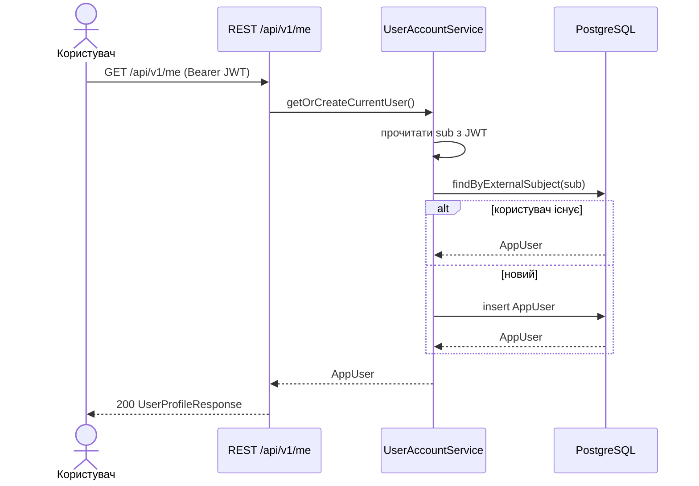
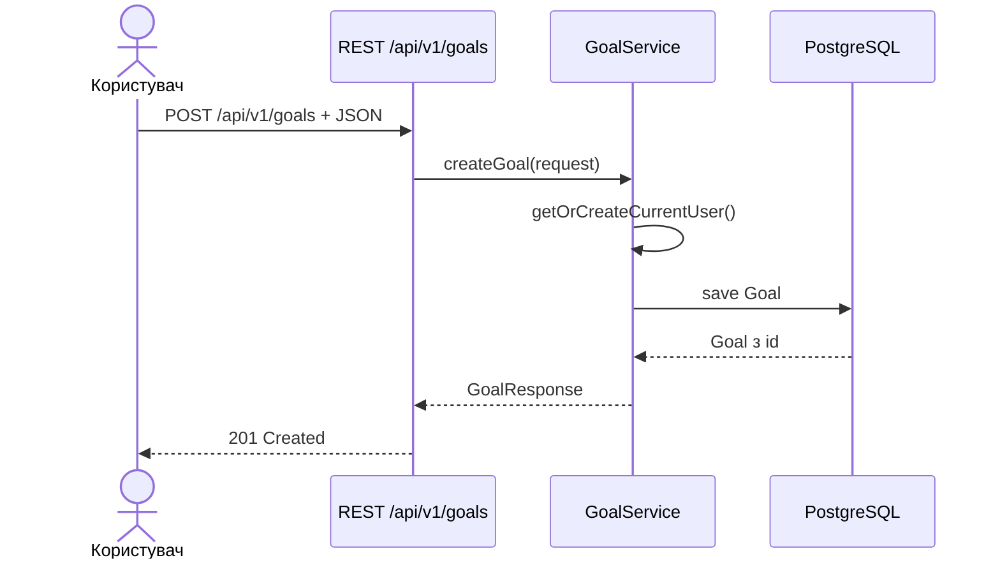
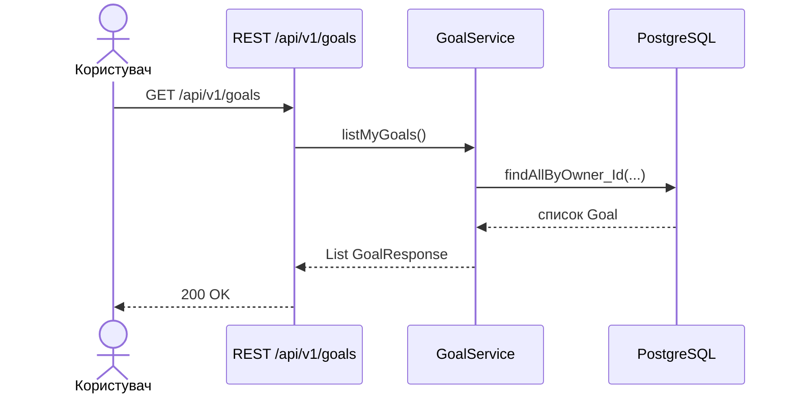
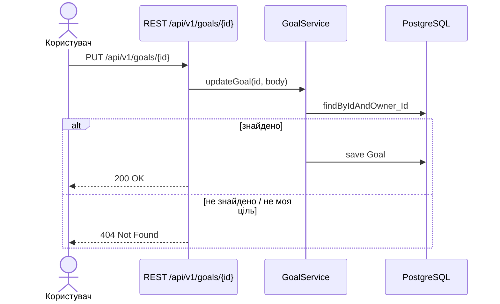

# User stories та діаграми послідовностей (Goal Tracker)

Джерело підходу: [IAMPM — як писати user stories](https://iampm.club/ua/blog/yak-pisati-user-stories-shhob-bulo-zrozumilo-vsim/).

## Формат

**Як** \<роль\>, **я хочу** \<дія\>, **щоб** \<цінність\>.

## Ролі

- **Користувач** — автентифікований суб’єкт OAuth2 / JWT (`sub` у токені).
- **Система** — Spring Boot REST API + PostgreSQL.

---

### US-1: Переглянути профіль

**Як** користувач, **я хочу** отримати свій профіль у системі, **щоб** переконатися, що акаунт синхронізовано з JWT.

**Критерії приймання:** відповідь містить `id`, `externalSubject`, `displayName`; при першому зверненні користувач створюється в БД.

---

### US-2: Створити ціль

**Як** користувач, **я хочу** додати ціль (назва, опис, дедлайн, статус), **щоб** фіксувати плани.

**Критерії приймання:** `title` обов’язковий; якщо `status` не передано — `PENDING`; відповідь `201` з об’єктом цілі.

---

### US-3: Переглянути список своїх цілей

**Як** користувач, **я хочу** бачити лише свої цілі, **щоб** не змішувати дані з іншими користувачами.

---

### US-4: Оновити / видалити ціль

**Як** користувач, **я хочу** оновлювати поля або видаляти ціль, **щоб** підтримувати актуальний стан.

**Критерії:** доступ лише до власних цілей; чужий `id` → `404` (ненавмисне розкриття відсутнє).

---

### US-5: Авторизація запитів

**Як** система, **я хочу** приймати лише запити з валідним JWT (HS256), **щоб** захистити API.

**Критерії:** без `Authorization` → `401`; Swagger та OpenAPI доступні без токена для документації.

---

## Зв’язок з інтеграційними тестами

Сценарії з `GoalApiIntegrationTest` покривають: US-2–US-5 (позитивні та негативні кейси).
