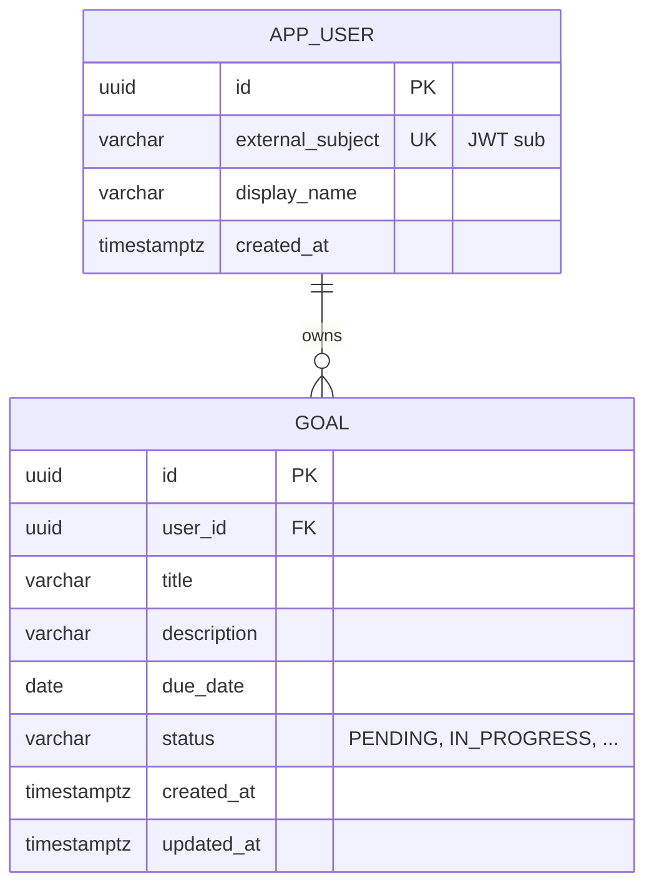

# ERD бази даних (Crow’s Foot)

Орієнтир: [Crow’s Foot ERD](https://medium.com/@callista.m.azizah/crows-foot-erd-for-beginners-a-tutorial-1effc8a326c6).

## Сутності

| Таблиця    | Опис |
|-----------|------|
| `app_user` | Локальний користувач, пов’язаний із `sub` з JWT (`external_subject` унікальний). |
| `goal`     | Ціль; належить рівно одному `app_user`; при видаленні користувача — каскадне видалення цілей. |

## Діаграмма (Mermaid ER)

## Обмеження та індекси

- `app_user.external_subject` — UNIQUE.
- `goal.user_id` → `app_user.id` (ON DELETE CASCADE).
- Індекси: `idx_goal_user_id`, `idx_goal_due_date` (для вибірок/фільтрів у майбутньому).

## Фізична схема

Реалізовано Flyway: `src/main/resources/db/migration/V1__init.sql`. Для PostgreSQL у проді та для тестів (H2 у режимі PostgreSQL) використано сумісні типи `TIMESTAMP(6) WITH TIME ZONE`.
