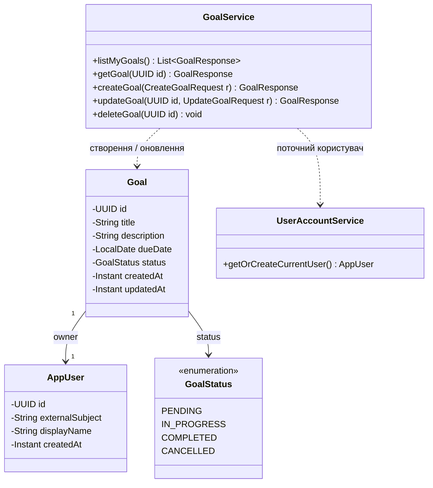

# Діаграма класів (лише бізнес-логіка)

Орієнтир: [UML class diagrams (GeeksforGeeks)](https://www.geeksforgeeks.org/unified-modeling-language-uml-class-diagrams/).

Нижче — класи, що реалізують **правила предметної області** та оркестрацію (без REST-контролерів, DTO та інфраструктури безпеки).

## Короткі пояснення

- **`UserAccountService`** — зв’язує JWT (`sub`) із записом `AppUser`; породжує запис при першій взаємодії.
- **`GoalService`** — усі операції з цілями виконуються в контексті поточного власника; доступ до чужої цілі трактується як відсутність ресурсу (`ResourceNotFoundException`).
